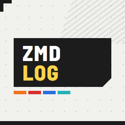
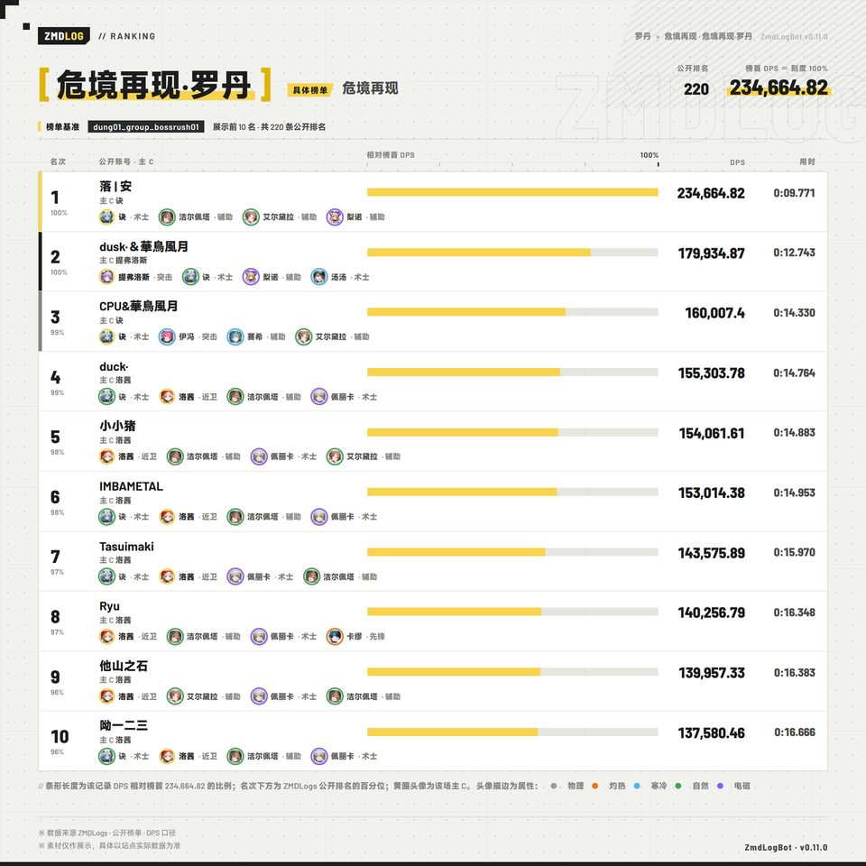
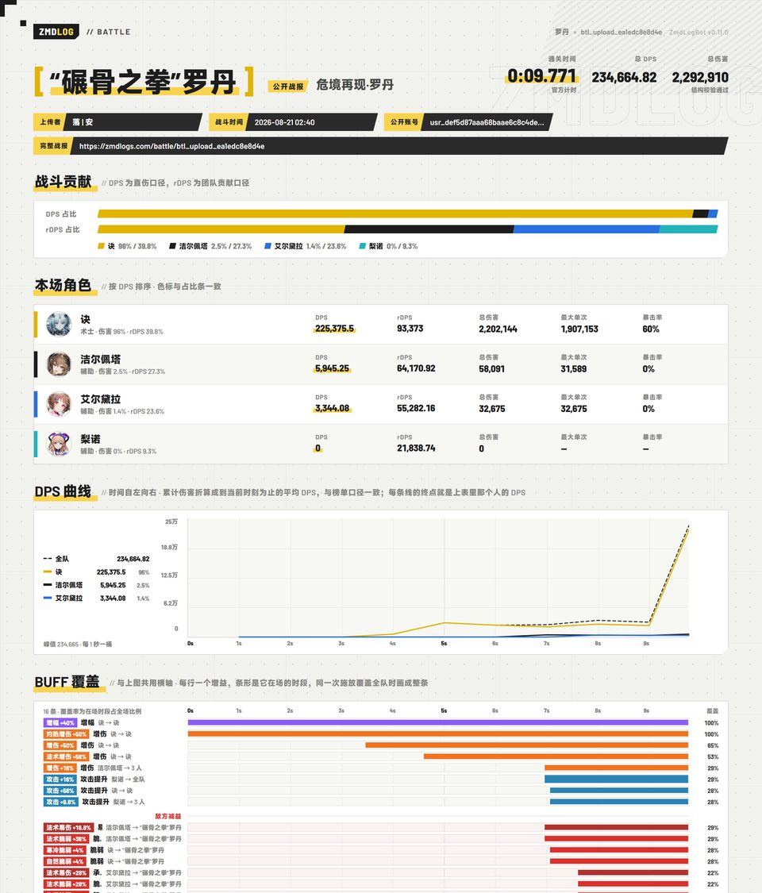
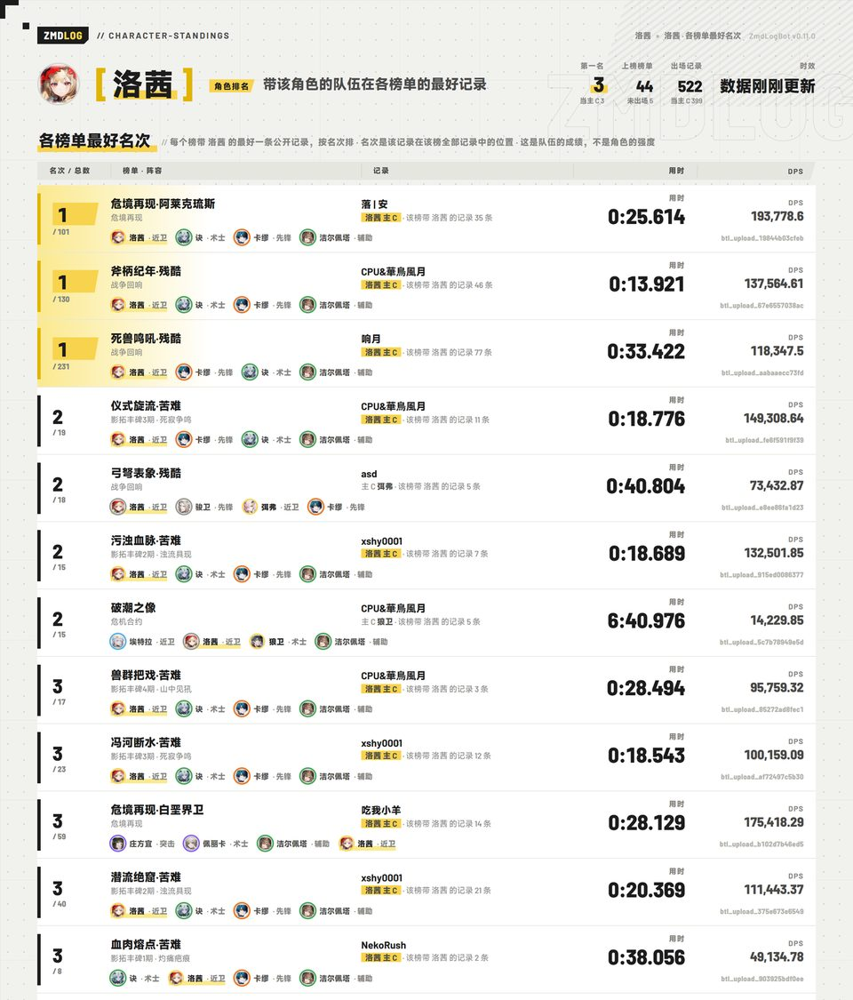
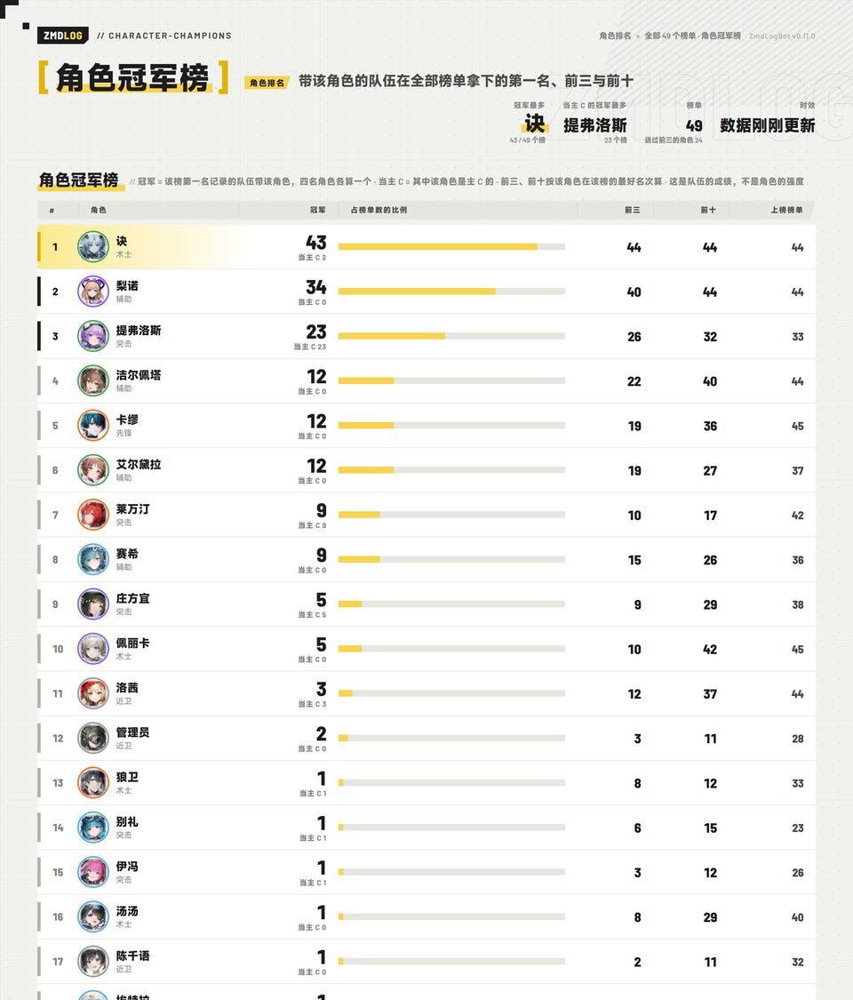
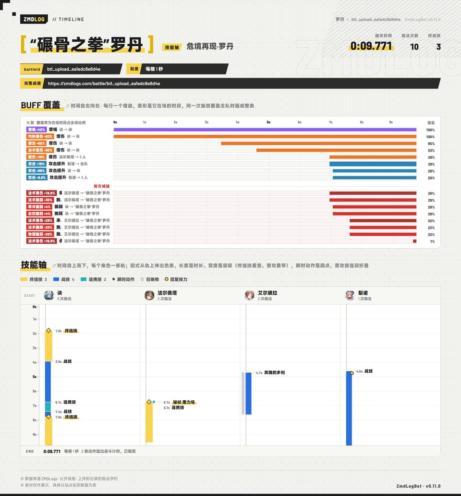
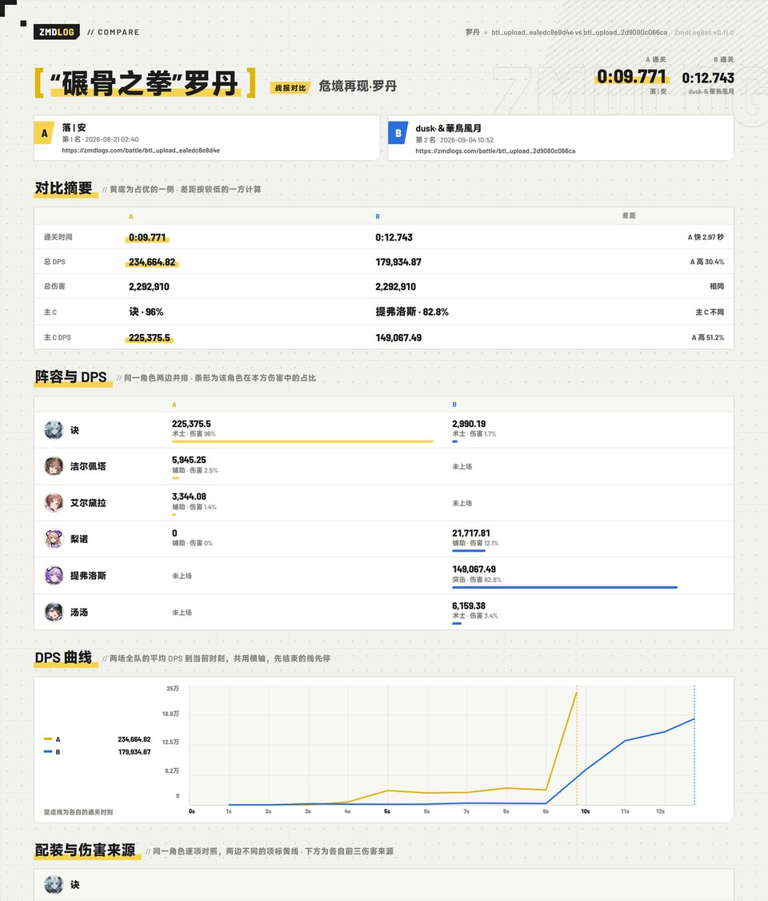

<div align="center">



# astrbot_plugin_zmdlog

### ZmdLogBot · 在聊天里查 ZMDLogs 榜单、账号与战报

[](https://github.com/AstrBotDevs/AstrBot)
[](https://www.python.org/)
[](metadata.yaml)
[](LICENSE)
[](https://github.com/Statrue/astrbot_plugin_zmdlog/stargazers)

《明日方舟：终末地》DPS 速通榜 [ZMDLogs](https://zmdlogs.com) 的 AstrBot 插件：
一句话查榜单、账号、战报，回一张终末地风格的长图；
接了大模型就直接用自然语言问。

</div>

---

## ✨ 特性

- **榜单**：全部榜单前三、具体榜单前 N 名、副本或期数下的全部榜、按角色 / 属性 / 职业筛选、阵容出场率与常见组合。
- **战报**：战斗贡献、DPS 曲线、BUFF 覆盖、施法节奏、每人的配装与伤害来源；配装页、技能统计页、整页技能轴；同一首领两场并排对比。
- **角色**：带某角色的队伍在各榜的最好名次，角色冠军榜（可按属性、职业、时间窗口），六星角色 DPS 分布（箱线图）。
- **账号**：公开账号各首领最佳记录、玩家排名、关注后的名次趋势。
- **绑定**：在 ZMDLogs 网站生成绑定码，把自己和公开账号对上号；`我的` 看自己的成绩，`群榜` 看本群绑定成员在某榜的排名。
- **通报**：关注账号或榜单后，名次下降、榜单前三出现新纪录时在本群提醒；`新纪录` 看最近谁刷新了第一。
- **大模型工具**：4 个 function-calling 工具，一个主题一个；图是权威，文字给模型解读。
- **一张长图**：所有查询结果都是 1280px 宽的单张 PNG，统一的终末地视觉；渲染失败可退回 AstrBot 自带的文转图。

## 📷 预览

| 具体榜单 | 战报卡 |
|:---:|:---:|
|  |  |
| **角色排名** | **角色冠军榜** |
|  |  |
| **技能轴** | **战报对比** |
|  |  |

## 📦 安装

**插件市场**：在 AstrBot 插件管理器里搜索 `astrbot_plugin_zmdlog` 安装。

**手动安装**：克隆到 AstrBot 的插件目录，然后在 AstrBot 使用的同一个 Python 环境里装依赖和 Chromium：

```bash
cd AstrBot/data/plugins
git clone https://github.com/Statrue/astrbot_plugin_zmdlog.git
cd astrbot_plugin_zmdlog
python -m pip install -r requirements.txt
python -m playwright install chromium
```

Docker 部署在宿主机执行：

```bash
docker exec -it astrbot python -m pip install -r /AstrBot/data/plugins/astrbot_plugin_zmdlog/requirements.txt
docker exec -it astrbot python -m playwright install chromium
docker restart astrbot
```

更新：`git pull --ff-only` 后重启 AstrBot；`requirements.txt` 有变化时先重新 `pip install`。

> 没装 Chromium 时插件会退回 AstrBot 自带的文转图服务（`fallback_to_astrbot_renderer`），能用，但样式和清晰度以内置 Chromium 为准。
> 渲染字体（Noto Sans SC / Barlow 子集，均为 SIL OFL 1.1）已内嵌；昵称里的生僻字会回退到系统字体，Docker 环境建议装一套中文字体（如 `fonts-noto-cjk`）。

## 🚀 快速开始

```text
/zmdlog                  帮助页
/zmdlog 罗丹              罗丹榜前 10 名（关键词认别名、拼音首字母：ld）
/zmdlog 战报 罗丹          罗丹第 1 名的战报卡
/zmdlog 角色排名 洛茜       带洛茜的队伍在每个榜排第几
/zmdlog 关注 榜单 罗丹      罗丹前三出新纪录时通报本群
```

## 🎮 指令

默认前缀是 `/`；AstrBot 改过唤醒前缀就用实际前缀。

### 榜单

| 指令 | 说明 |
|:---|:---|
| `/zmdlog 榜单` | 全部公开榜单及各榜前三 |
| `/zmdlog <关键词>` | 具体榜单前 10 名；命中副本或期数时列出其下全部榜 |
| `/zmdlog <关键词> --top <1-30>` | 展示前 N 名 |
| `/zmdlog <关键词> --角色 <角色名…>` | 只看带该角色的记录；写多个名字时只看同时带上他们的队伍 |
| `/zmdlog <关键词> --属性 <属性>` | 只看主 C 为该属性的记录 |
| `/zmdlog <关键词> --口径 rdps` | 该榜的 rDPS 排名（阵容、群榜、角色统计、角色排名、玩家排名、新纪录也认这个选项） |
| `/zmdlog 阵容 <关键词> [--top N]` | 职业位出场率、前 N 名常见阵容与主 C 分布 |
| `/zmdlog 新纪录 [--范围 7d\|14d\|30d]` | 第一名易主、新上传的记录、各榜活跃度（默认近 7 天） |

### 战报

| 指令 | 说明 |
|:---|:---|
| `/zmdlog 战报 <battleId 或链接>` | 战报卡：贡献、DPS 曲线、BUFF 覆盖、施法节奏、配装概览 |
| `/zmdlog 战报 <关键词> [名次]` | 该榜第 N 名的战报卡，默认第 1（`战报 罗丹 3`） |
| `/zmdlog 配装 <同上>` | 每人的等级、潜能、武器、技能等级与四件装备词条（别名 `装备`） |
| `/zmdlog 技能 <同上>` | 每人各技能的次数、总伤、占比、均伤、最高（别名 `技能统计`） |
| `/zmdlog 技能轴 <同上>` | 施法节奏放大成整页（别名 `排轴` / `时间轴`） |
| `/zmdlog 对比 <关键词> [名次A] [名次B]` | 同一榜两场并排，默认第 1 对第 2（别名 `比较`） |
| `/zmdlog 对比 <battleId> <battleId>` | 指定两场并排；须是同一首领 |

### 角色与账号

| 指令 | 说明 |
|:---|:---|
| `/zmdlog 角色排名 <角色名…>` | 带该角色的队伍在每个榜的最好记录（任何星级）；写几个名字就只看同时带上他们的队伍 |
| `/zmdlog 角色排名 [--属性 X] [--职业 X] [--范围 X]` | 角色冠军榜：每个角色的队伍拿下的第一、前三、前十各几个 |
| `/zmdlog 角色统计 [关键词] [--范围 X] [--潜能 X]` | 六星角色 DPS 分布：不填看全部榜单，填榜单看该榜，填角色名看它在各榜 |
| `/zmdlog 玩家排名 [--范围 X]` | 各公开账号的第一、前三、前十各几个（写昵称则是那个人的成绩）|
| `/zmdlog 账号 <昵称、accountId 或主页链接>` | 公开账号各首领最佳记录 |
| `/zmdlog 趋势 <账号> [--范围 7d\|14d\|30d\|all]` | 关注过的账号各榜名次随时间的变化（默认近 30 天） |

### 绑定

| 指令 | 说明 |
|:---|:---|
| `/zmdlog 绑定 <绑定码>` | 把自己和一个 ZMDLogs 账号对上号。绑定码在网站登录后从 账号菜单 → 机器人绑定（`/account/binding`）生成，10 分钟内有效，只能用一次；只认绑定码，不认昵称或 accountId。这一组指令都只在群聊里用，不需要加机器人好友 |
| `/zmdlog 我的 [序号或昵称]` | 自己绑定账号的各首领最佳记录（同 `账号 <accountId>`），默认主账号 |
| `/zmdlog 主账号 [序号或昵称]` | 列出自己的绑定；带参数则把那个号设为主账号（一人最多绑 5 个） |
| `/zmdlog 解绑 [序号、昵称或 全部]` | 解除绑定；只绑了一个号时不用带参数 |
| `/zmdlog 群榜 <榜单关键词> [--top N]` | 本群绑定成员在该榜的最好记录，按全榜名次排（别名 `群排名`）。绑定过的人在本群用过 `我的` / `群榜` / `绑定` 才算本群成员 |

### 关注与管理

| 指令 | 说明 |
|:---|:---|
| `/zmdlog 关注 <账号>` / `关注 榜单 <关键词>` | 加入本群关注；账号掉名次、榜单前三出新纪录时通报 |
| `/zmdlog 关注` | 本群关注列表与序号 |
| `/zmdlog 取关 <序号或名字>` / `取关 榜单 <序号或关键词>` | 取消关注（添加者本人或管理员） |
| `/zmdlog 别名` / `别名 添加 <榜单或副本> <别名…>` / `别名 删除 <别名>` | 管理员维护群里的叫法，立即生效 |

### 关键词与选项

- 榜单名可以省略难度和副本前缀（`罗丹`、`山犼争王`），副本可以写一段或"系列+期数"（`山中见犼`、`丰碑4`、`影拓4`），拼音全拼和首字母都认（`luodan`、`ld`、`fb4`）。管理员加过的别名优先于自动推导的。
- 匹配到多个目标时回一份编号候选列表，**引用那条消息回复序号**（`2`、`②`、`第2个` 都行）即可，10 分钟内有效。
- 直接输入昵称时，榜单没有精确命中就同时搜索公开账号。
- 选项写在末尾，`--选项 值`，顺序不限。`--属性` 认 物理 / 灼热 / 寒冷 / 自然 / 电磁，也认 火、冰、雷；`--职业` 认 先锋 / 近卫 / 重装 / 术士 / 突击 / 辅助，术师也认；`--范围` 认 `7d/14d/30d/all`，也认 一周、两周、一个月、近 30 天；`--潜能` 只有 `0`（零潜）/ `1-5`（有潜能）/ `all` 三档，这是上游接口的粒度。
- `--口径 rdps`（也认 `团队贡献`）看每个榜的 rDPS 排名：只收录能算出团队贡献的记录（新版上传器的上传，目前很少），名次仍按通关时间排，主 C 按 rDPS 最高的角色算；具体榜单页会注明每条记录在 DPS 榜的名次和 DPS 口径的主 C。不写口径就是 DPS，关注、趋势、账号页只有 DPS。
- `--角色` 优先看以该角色为主 C 的记录，该榜没有时自动改为看整个阵容，页面会注明。

## 🤖 大模型工具

AstrBot 接入大模型并开启函数调用后，群友直接用自然语言问：

| 工具 | 回答什么 |
|:---|:---|
| `zmdlogs_board_ranking` | 某榜前几名（用时、DPS、主 C、阵容、日期、落后第一几秒）、职业位出场率、常见阵容；可按角色 / 属性 / 职业 / 时间窗口筛；填副本看其下每个榜的前三，填"全部"看所有榜的第一名，留空看最近的新纪录 |
| `zmdlogs_battle_report` | 某场战报：用时、各角色 DPS、暴击率、最大单次、配装与套装、伤害来源、BUFF 覆盖、施放次数、开场顺序；给第二场就并排对比 |
| `zmdlogs_character_standings` | 某角色的队伍在各榜的最好名次、最常同队的人、六星 DPS 分布（可限定范围和潜能）；留空看角色冠军榜（可按属性、职业筛） |
| `zmdlogs_account_records` | 某公开账号各首领最好成绩、记录数、冠军数、常用主 C 和阵容、关注过的账号的名次变化；留空看玩家排名 |

几条刻意的设计：

- **一个主题一个工具，不按功能点拆。** 每条经过模型的消息都带上全部工具的说明，工具越多越贵，相近的工具越多模型越容易选错。
- **图是权威，文字是解读。** 工具把长图发到群里，同时把事实以文字交给模型，并要求模型不要复述数字；一次回答只查了一个对象才发图。
- **只回答"公开记录里有什么"，不回答"谁更强"。** 榜单是自我选择的样本，出场次数、名次、分布都可以答，强度判断和循环 DPS 不在范围内。
- **拿不准就说拿不准。** 关键词只是勉强相似时工具直接说没有可靠匹配，而不是猜一个最接近的。

## ⚙️ 配置

在 AstrBot 的插件配置页修改，通常无需改动。

| 配置项 | 默认 | 说明 |
|:---|:---|:---|
| `api_base_url` | `https://zmdlogs.com` | ZMDLogs API 地址 |
| `web_base_url` | `https://zmdlogs.com` | 网页地址，用于识别链接、拼接头像和主页 |
| `request_timeout_ms` | `10000` | API 请求超时 |
| `render_timeout_ms` | `30000` | 图片渲染超时 |
| `fallback_to_astrbot_renderer` | `true` | 内置 Chromium 不可用时改用 AstrBot 的文转图 |
| `alias_file_path` | `aliases.json` | 别名文件，相对 `data/plugin_data/astrbot_plugin_zmdlog/` |
| `ranking_cache_ttl_seconds` | `60` | 具体榜单查询接受多旧的数据 |
| `account_cache_ttl_seconds` | `60` | 账号成绩缓存 |
| `character_stats_cache_ttl_seconds` | `120` | 角色统计缓存 |
| `battle_cache_ttl_seconds` | `300` | 战报缓存 |
| `auto_expand_battle_links` | `false` | 群里出现战报链接时自动回战报卡 |
| `battle_link_dedupe_seconds` | `300` | 同群同战报自动展开的冷却 |
| `fuzzy_match_threshold` | `0.65` | 模糊匹配最低可信阈值 |
| `ambiguity_score_gap` | `0.08` | 要求用户选择候选的最小分差 |
| `rank_watch_enabled` | `true` | 名次通报（关注 / 取关 与轮询） |
| `rank_watch_interval_seconds` | `900` | 名次检查间隔，最低 120 |
| `rank_watch_rank_threshold` | `10` | 只通报原名次在前几名以内的下降 |
| `ranking_index_enabled` | `true` | 后台常驻全部榜单排名（榜单索引） |
| `ranking_index_pace_seconds` | `30` | 索引每隔多少秒重读一个榜，最低 5 |
| `bindings_enabled` | `true` | 账号绑定（绑定 / 我的 / 群榜）；关闭后已有绑定仍可查看和解除 |
| `group_board_max_accounts` | `30` | 群榜最多统计多少个绑定账号，1–200 |

## 🔍 它是怎么工作的

- **榜单索引**：启动后把全部榜的排名读进内存（约 5 MB，十几秒），之后每 30 秒重读一个榜、每分钟核对一次各榜前三，前三变了立即重读。角色排名、冠军榜、名次通报、新纪录都从索引读，不等上游；稳态下无论有没有人问，每分钟约 3 个请求。上游拒绝时按指数退避。
- **通报只说能证明的事**：一次榜单读取无法证明是谁把某人顶下去的，所以账号通报只列出这段时间新出现在它上方的纪录；榜单通报则能说出谁跌出了前三。
- **绑定只认绑定码**：机器人拿着绑定码向 ZMDLogs 查一次它对应哪个账号，查到就绑；网站只把码发给登录了那个账号的人，所以不会有人冒绑。查码接口不消耗码，插件自己记住用过的码的摘要，同一个码第二个人再发就拒绝。插件不缓存绑定码，也不把它写进日志（请求日志里显示为 `ZMD-****-****`）。绑定、我的、群榜都只在群聊里响应，机器人不需要加任何人好友。群榜从索引里的一份榜单读本群绑定账号的最好记录，不逐账号请求。
- **本地文件**（都在插件数据目录，只含公开 accountId、公开昵称、名次和 battleId）：`watchlist.json`、`rank-snapshot.json`、`board-snapshot.json`、`rank-history.json`（90 天 / 每榜 120 个点）、`record-events.json`（30 天 / 1000 条）、`hot-bosses.json`（上游不可达时的榜单列表快照）、`aliases.json`、`bindings.json`（平台用户 ID ↔ 公开 accountId 与昵称快照、用过绑定指令的群、用过的绑定码的 SHA-256）。读不出来的文件会改名为 `.corrupt-<时间>` 并写日志，不会被静默覆盖。
- **渲染**：最多 2 张图同时渲染、8 个排队；头像等图标只允许从配置的域名加载并在内存缓存 30 天；输出图片定期清理。

## ❓ 常见问题

**提示"图片生成失败"** — 确认 Chromium 装在 AstrBot 实际使用的 Python 环境里（`python -m playwright install chromium`），Docker 用户还要确认 `/AstrBot/data` 可写并完整重启容器。

**提示"ZMDLogs 暂时不可用"** — 检查 AstrBot 所在机器到 `https://zmdlogs.com` 的连通性，看日志里的 `ZmdLogBot … request failed`。

**提示"榜单索引还在建立"** — 刚启动的十几秒内会这样，稍后再问即可。

**昵称查不到账号** — 昵称需要 2–64 个字符，只能搜到有公开记录的账号；多个结果时回复序号，或直接用 accountId / 主页链接。

**`--top` 没效果** — 只作用于具体榜单、阵容和群榜页，全部榜单与副本页固定前三。

**提示"当前配置的 ZMDLogs 地址没有绑定码接口"** — `api_base_url` 指向的镜像或旧部署没有绑定码功能；官方站 zmdlogs.com 已经有了。

**群榜上没有某个人** — 只有在本群用过 `绑定` / `我的` / `群榜` 的绑定用户才算本群成员，让 TA 在群里发一次 `/zmdlog 我的` 即可；绑定账号超过 `group_board_max_accounts` 时只取最近用过绑定指令的人。

## 🛠️ 开发

```bash
python -m unittest discover -s tests -v      # 全部测试，离线，约 4 秒
python -m ruff check main.py core tests tools
```

`main.py` 是唯一接触 AstrBot 的文件；`core/` 里是全部逻辑，不引用 AstrBot，可以单独测。每个模块的设计与取舍写在它自己的 docstring 里；不变量与设计决策见 [CLAUDE.md](CLAUDE.md)，上游接口事实见 [UPSTREAM.md](UPSTREAM.md)，视觉资源说明见 [resources/common/ASSETS.md](resources/common/ASSETS.md)。

## 📄 数据、许可与鸣谢

- **非官方项目。** 本插件是 [ZMDLogs](https://zmdlogs.com) 的第三方客户端，与 ZMDLogs 站方无从属关系，也与《明日方舟：终末地》的开发商上海鹰角网络无关。游戏名称、角色、头像等素材的版权归鹰角所有，本插件只在渲染时按公开地址引用，不在仓库内分发。
- 只读取 ZMDLogs 已公开的榜单、账号成绩和战报，不处理登录凭据或私人记录；内容以上游为准。绑定只保存平台用户 ID 和公开 accountId 的对应关系，ZMDLogs 不会收到 QQ 号。预览截图里的昵称与成绩都是当时榜单上的公开信息。
- 请求量：稳态每分钟约 3 个请求（见[它是怎么工作的](#-它是怎么工作的)），User-Agent 标明了插件名与版本。若 ZMDLogs 站方希望调整频率或停用某项功能，请开 issue，我会照办。
- [MIT License](LICENSE)，仅覆盖本仓库的代码与自绘素材。内嵌字体各有其许可，见 [ASSETS.md](resources/common/ASSETS.md)。
- 感谢 [ZMDLogs](https://zmdlogs.com) 提供公开数据，[AstrBot](https://github.com/AstrBotDevs/AstrBot) 提供运行框架。

<div align="center">

如果这个插件对你有帮助，欢迎点一个 Star。

</div>
