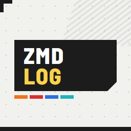
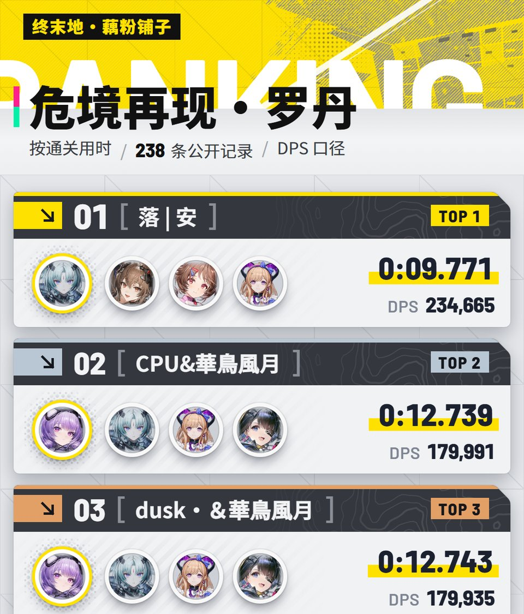
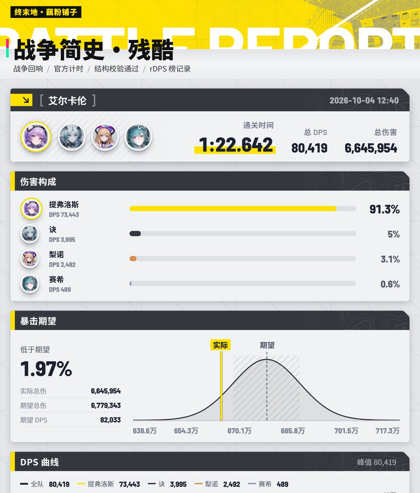
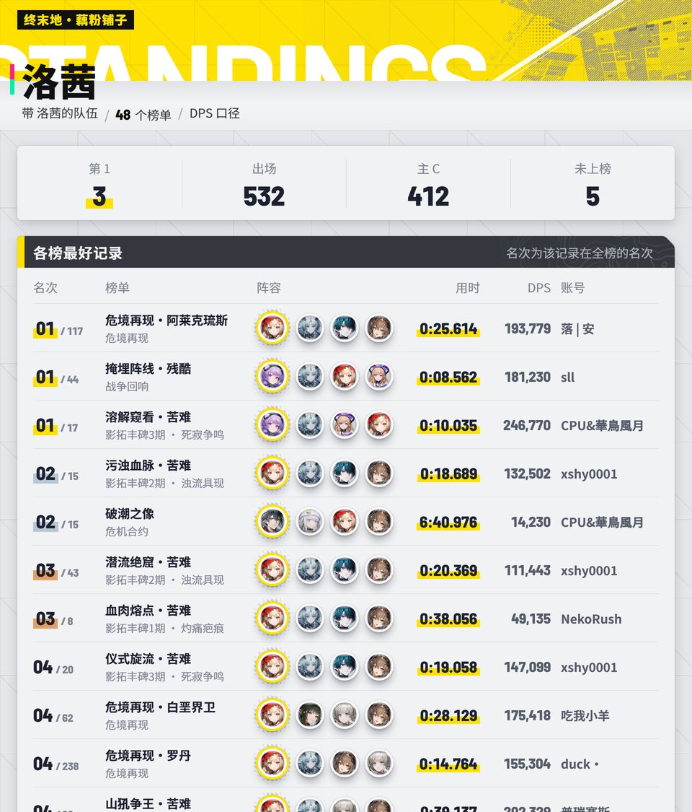
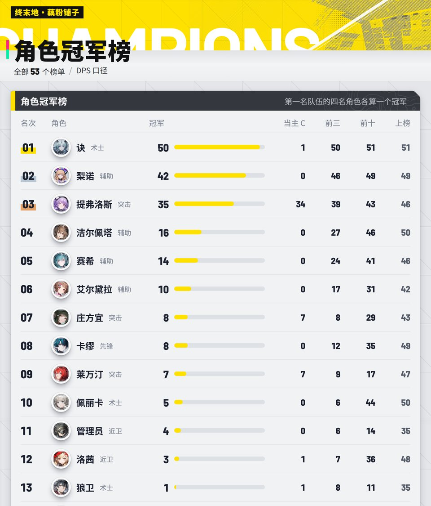
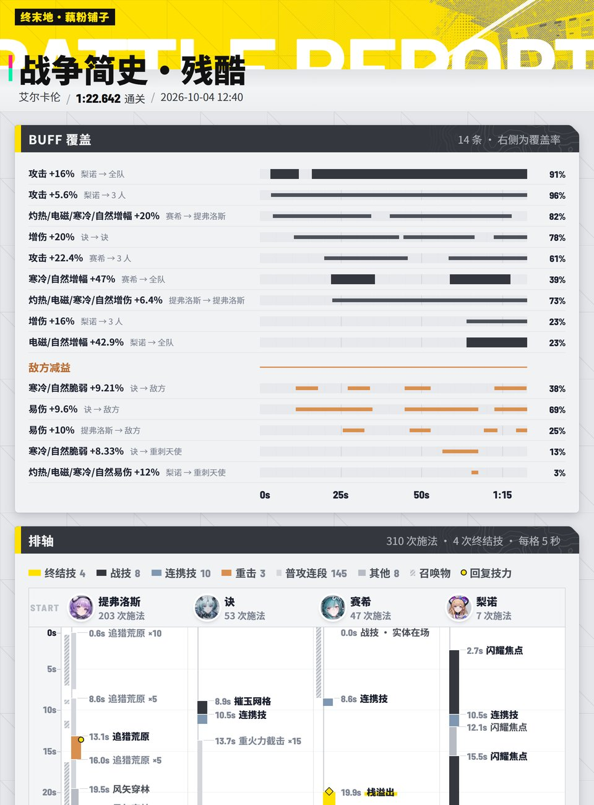
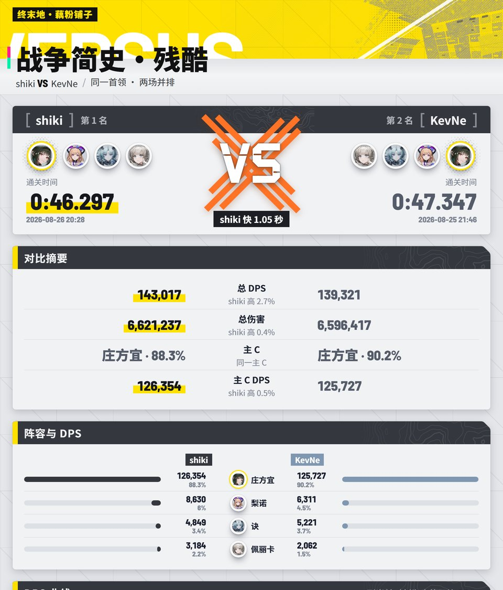

<div align="center">



# astrbot_plugin_zmdlog

### 终末地·藕粉铺子 — 在聊天里查 ZMDLogs 榜单、账号与战报

[](https://github.com/AstrBotDevs/AstrBot)
[](https://www.python.org/)
[](metadata.yaml)
[](LICENSE)
[](https://github.com/Statrue/astrbot_plugin_zmdlog/stargazers)

《明日方舟：终末地》DPS 速通榜 [ZMDLogs](https://zmdlogs.com) 的 AstrBot 插件：
一句话查榜单、账号、战报，回一张终末地风格的长图；
接了大模型就直接用自然语言问。

</div>

---

## ✨ 特性

- **榜单**：副本列表、各榜前三、具体榜单分页，按角色 / 属性筛选，阵容出场率与常见组合。
- **战报**：摘要、数据、排轴、养成四个视图，同一首领两场并排对比。
- **角色与账号**：角色排名、角色冠军榜、六星 DPS 分布、角色档案；账号最佳记录、玩家排名、名次趋势。
- **绑定**：用 ZMDLogs 网站的绑定码认领自己的账号，`我的` 看成绩，`对比 <榜单> 我` 对比第一名。
- **通报**：关注榜单后，新纪录进前 10 名就发一张「顶屁股通告」，写明它把谁顶了下去。
- **大模型工具**：4 个 function-calling 工具，一个主题一个。
- **一张图**：每个查询结果都是一张 PNG；具体榜单是 540px 手机长图，其余是 960px 宽图，都按 2 倍截取。
- **QQ 官方机器人**：候选列表和结果图下带按钮，可选一点即出图。

## 📷 预览

| 具体榜单 | 战报 |
|:---:|:---:|
|  |  |
| **角色排名** | **角色冠军榜** |
|  |  |
| **排轴** | **战报对比** |
|  |  |

## 📦 安装

AstrBot 面板 → 插件市场，搜「终末地·藕粉铺子」或 `zmdlog`，点安装。Python 依赖会自动装，Chromium 要自己补一次：

```bash
python -m playwright install chromium
```

<details>
<summary>手动克隆 / Docker / 更新</summary>

克隆到 AstrBot 的插件目录，在 AstrBot 使用的同一个 Python 环境里装依赖和 Chromium：

```bash
cd AstrBot/data/plugins
git clone https://github.com/Statrue/astrbot_plugin_zmdlog.git
cd astrbot_plugin_zmdlog
python -m pip install -r requirements.txt
python -m playwright install chromium
```

Docker 部署在宿主机执行：

```bash
docker exec -it astrbot python -m pip install -r /AstrBot/data/plugins/astrbot_plugin_zmdlog/requirements.txt
docker exec -it astrbot python -m playwright install chromium
docker restart astrbot
```

更新：市场装的在面板里点更新，克隆装的 `git pull --ff-only` 后重启 AstrBot；`requirements.txt` 有变化时先重新 `pip install`。

</details>

> 没装 Chromium 时退回 AstrBot 自带的文转图（`fallback_to_astrbot_renderer`），能用但不如内置渲染清晰。字体（Noto Sans SC / Barlow 子集，SIL OFL 1.1）已内嵌；昵称里的生僻字回退到系统字体，Docker 环境建议装 `fonts-noto-cjk`。

## 🚀 快速开始

```text
/zmdlog                  帮助页
/zmdlog 罗丹              罗丹榜前 10 名（关键词认别名、拼音首字母：ld）
/zmdlog 战报 罗丹          罗丹第 1 名的战报摘要
/zmdlog 角色排名 洛茜       带洛茜的队伍在每个榜排第几
/zmdlog 角色档案 莱万汀     莱万汀大家怎么养、配什么、带谁
/zmdlog 关注 罗丹          罗丹有新纪录进前 10 时在这里发通告图
```

## 🎮 指令

默认前缀是 `/`；AstrBot 改过唤醒前缀就用实际前缀。

### 榜单

| 指令 | 说明 |
|:---|:---|
| `/zmdlog 榜单` | 全部副本列表，引用回复序号看该副本各榜前三 |
| `/zmdlog <关键词>` | 具体榜单第 1 页（第 1–10 名）；命中副本或期数时出其下各榜前三，只有一张榜的副本直接出榜单 |
| `/zmdlog <关键词> --页 <N>` | 第 N 页，每页 10 条（也写 `--page N`、`-p N`） |
| `/zmdlog <关键词> --页 全部` | 一张图看前 30 条（也写 `--页 all`），其余到 ZMDLogs 官网看 |
| `/zmdlog <关键词> --角色 <角色名…>` | 只看带该角色的记录；写多个名字是同时带上他们的队伍 |
| `/zmdlog <关键词> --属性 <属性>` | 只看主 C 为该属性的记录 |
| `/zmdlog <关键词> --口径 rdps` | 该榜的 rDPS 排名 |
| `/zmdlog 阵容 <关键词>` | 职业位出场率、前 10 名的常见阵容与主 C 分布 |
| `/zmdlog 新纪录 [--范围 7d\|14d\|30d]` | 第一名易主、新上传的记录、各榜活跃度（默认近 7 天） |

危机合约榜按合约分数排。翻页时 `--角色` / `--属性` / `--口径` 照样生效。

### 战报

`<同上>` 是 battleId、战报链接，或 `<关键词> [名次]`（该榜第 N 名，默认第 1；加 `--口径 rdps` 按 rDPS 榜的名次找）。

| 指令 | 说明 |
|:---|:---|
| `/zmdlog 战报 <同上>` | 摘要：用时、总 DPS、总伤害、阵容、伤害构成、暴击期望、DPS 曲线 |
| `/zmdlog 数据 <同上>` | 完整角色表、战斗贡献、暴击期望、DPS 曲线、技能伤害、危机合约词条 |
| `/zmdlog 排轴 <同上>` | BUFF 覆盖与施法时间轴 |
| `/zmdlog 养成 <同上>` | 每人的等级、潜能、技能、武器与装备 |
| `/zmdlog 对比 <关键词> [名次A] [名次B] [--口径 rdps]` | 同一榜两场并排，默认第 1 对第 2（别名 `比较`） |
| `/zmdlog 对比 <关键词> 我 [名次] [--口径 rdps]` | 自己主账号在该榜的最好记录对比第 N 名（默认第 1），要先绑定 |
| `/zmdlog 对比 <battleId> <battleId>` | 指定两场并排，须是同一首领 |

暴击期望只有 2026-09-25 起新客户端上传的战报有；老战报缺的页面或板块不出。

### 角色与账号

`--范围` 认 `7d` / `14d` / `30d` / `all`。

| 指令 | 说明 |
|:---|:---|
| `/zmdlog 角色排名 <角色名…>` | 带该角色的队伍在每个榜的最好记录；写几个名字就是同时带上他们的队伍 |
| `/zmdlog 角色排名 [--属性 X] [--职业 X] [--范围 X]` | 角色冠军榜：每个角色的队伍拿下的第一、前三、前十各几个 |
| `/zmdlog 角色统计 [关键词] [--范围 X] [--潜能 X]` | 六星角色 DPS 分布：不填看全部榜单，填榜单看该榜，填角色名看它在各榜 |
| `/zmdlog 角色档案 <角色名> [--榜单 X] [--范围 X]` | 养成、武器、装备、队友各占多少，加它在各榜的通关名次；`--榜单` 只看一个榜 |
| `/zmdlog 玩家排名 [--范围 X]` | 各公开账号的第一、前三、前十各几个 |
| `/zmdlog 账号 <昵称、accountId 或主页链接>` | 公开账号各首领最佳记录 |
| `/zmdlog 趋势 <账号> [--范围 X]` | 任一公开账号各榜名次随时间的变化（默认近 7 天，`all` 是近 90 天） |

### 绑定

绑定码在 ZMDLogs 登录后从 账号菜单 → 机器人绑定（`/account/binding`）生成，10 分钟内有效、只能用一次。只认绑定码，不认昵称或 accountId。群聊私聊都能用。

| 指令 | 说明 |
|:---|:---|
| `/zmdlog 绑定 <绑定码>` | 把自己和一个 ZMDLogs 账号对上号（一人最多 5 个） |
| `/zmdlog 我的 [序号或昵称]` | 自己绑定账号的各首领最佳记录，默认主账号 |
| `/zmdlog 主账号 [序号或昵称]` | 列出自己的绑定；带参数则设为主账号 |
| `/zmdlog 解绑 [序号、昵称或 全部]` | 解除绑定；只绑了一个号时不用带参数 |

### 关注与管理

| 指令 | 说明 |
|:---|:---|
| `/zmdlog 关注 <榜单关键词>` | 关注一张榜；群里按整个群算，私聊也能用 |
| `/zmdlog 关注 全部` | 关注全部榜单，以后新出的榜也包含；`取关 <榜单>` 排除单张 |
| `/zmdlog 关注` | 这里的关注列表与序号 |
| `/zmdlog 取关 <序号或榜单关键词>` | 取消关注一张榜（添加者本人或管理员） |
| `/zmdlog 取关 全部` | 清空这里的关注 |
| `/zmdlog 别名` / `别名 添加 <榜单或副本> <别名…>` / `别名 删除 <别名>` | 管理员维护群里的叫法，立即生效 |

**通报**：关注的榜上有新的 DPS 记录进入前 N 名（默认 10），就画进一张「顶屁股通告」——这条新记录，加上被它顶下去的每个账号（原名次 → 现名次，掉出前 N 的标出来），第一名易主时标「新冠军!」。每个聊天每 15 分钟最多一张，几张榜的变动合在一起。只有名次变化而没有新记录不算，rDPS 榜不通报。想看某个账号的走势用 `趋势`，不用关注。

### 关键词与选项

- 榜单名可以省略难度和副本前缀（`罗丹`、`山犼争王`），副本可以写一段或"系列+期数"（`山中见犼`、`丰碑4`、`影拓4`），拼音全拼和首字母都认（`luodan`、`ld`、`fb4`）。管理员加的别名优先。
- 匹配到多个目标时回一份编号候选列表，**引用那条消息回复序号**（`2`、`②`、`第2个` 都行），10 分钟内有效。
- 榜单没有精确命中时同时按昵称搜索公开账号。
- 选项写在末尾，顺序不限：
  - `--页`：页码或 `全部` / `all`，也写 `--page`、`-p`
  - `--属性`：物理 / 灼热 / 寒冷 / 自然 / 电磁，也认 火、冰、雷
  - `--职业`：先锋 / 近卫 / 重装 / 术士 / 突击 / 辅助，术师也认
  - `--范围`：`7d` / `14d` / `30d` / `all`，也认 一周、两周、一个月、近 30 天
  - `--潜能`：`0`（零潜）/ `1-5`（有潜能）/ `all`
  - `--口径 rdps`（也认 `团队贡献`）：具体榜单、阵容、角色统计、角色排名、玩家排名、新纪录，和按名次查的战报、对比都认。rDPS 榜只收录能算出团队贡献的记录，目前很少；关注、趋势、账号页只有 DPS
  - `--角色`：优先看以该角色为主 C 的记录，该榜没有时改看整个阵容

## 🔘 QQ 官方机器人

AstrBot 内置的 `qq_official`（WebSocket 版）适配器上多出按钮，群聊私聊一样；其他平台一切照旧，候选列表引用回复序号。

- **候选列表**：每项一个按钮，点一下把完整指令填进输入框。按钮里存的是指令本身，不受 10 分钟限制，谁都能点。
- **结果图**：「在 ZMDLogs 打开」直达网站，再加至多 3 个按钮看同一对象的其他页面（战报四个视图互通，榜单 ↔ 阵容 ↔ 角色统计，账号 ↔ 名次趋势）。
- **榜单页**：「阵容」「角色统计」/「第一名战报」「对比第一名」/「全部」「下一页」/「在 ZMDLogs 打开」，翻页照带当前的选项。
- **副本前三页**：每张榜一个按钮。
- **榜单通报**：由插件自己发，需要群主先开「机器人主动在群聊内发言」。

哪一步发不出去，就改发其他平台上的样子。配置 `disable_qq_official_buttons` 打开后全部回到这个样子。

**一点即出图**（配置 `qq_official_callbacks`，默认关闭）：查询类按钮点一下直接出图，不经过输入框；改设置的按钮仍然只填指令。插件在运行时给内置适配器打一个最小补丁接收按钮回调，不改 AstrBot 本体，改了开关要重启官方机器人平台。同一聊天里同一个按钮 60 秒内只出一次图。

不支持的组合：

- **与 qqoffice_expand 不兼容**：两个插件会抢着应答同一次点击。检测到它启用时插件不装回调，按钮照旧填指令。
- **`qq_official_webhook` 和 `qq_official_v2` 没有按钮**；`qq_official_v2` 上的绑定和关注按 `qq_official` 记。
- **大模型工具发的图**不带按钮。

## 🤖 大模型工具

AstrBot 接入大模型并开启函数调用后，群友直接用自然语言问：

| 工具 | 回答什么 |
|:---|:---|
| `zmdlogs_board_ranking` | 某榜前几名、职业位出场率、常见阵容，可按角色 / 属性 / 职业 / 时间窗口筛；填副本看各榜前三，填"全部"列出所有榜的第一名（只回文字），留空看最近的新纪录 |
| `zmdlogs_battle_report` | 某场战报的用时、各角色数据、暴击期望、养成、伤害来源、BUFF 覆盖、危机合约词条；给第二场就并排对比 |
| `zmdlogs_character_standings` | 某角色的队伍在各榜的最好名次、常见队友、六星 DPS 分布；`view` 填 `档案` 看角色档案；留空看角色冠军榜 |
| `zmdlogs_account_records` | 某公开账号各首领最好成绩、冠军数、常用主 C 与阵容、名次变化；留空看玩家排名 |

四条刻意的设计：

- **一个主题一个工具**：每条消息都带上全部工具的说明，工具越多越贵、越容易选错。
- **图是权威，文字是解读**：工具把图发到群里，同时把事实以文字交给模型，并要求不要复述数字。
- **只回答"公开记录里有什么"**：榜单是自我选择的样本，强度判断和循环 DPS 不在范围内。
- **拿不准就说拿不准**：关键词只是勉强相似时直接说没有可靠匹配，不猜。

## ⚙️ 配置

在 AstrBot 的插件配置页修改，通常无需改动。

| 配置项 | 默认 | 说明 |
|:---|:---|:---|
| `api_base_url` | `https://zmdlogs.com` | ZMDLogs API 地址 |
| `web_base_url` | `https://zmdlogs.com` | 网页地址，用于识别链接、拼接头像和主页 |
| `request_timeout_ms` | `10000` | API 请求超时 |
| `render_timeout_ms` | `30000` | 图片渲染超时 |
| `fallback_to_astrbot_renderer` | `true` | 内置 Chromium 不可用时改用 AstrBot 的文转图 |
| `alias_file_path` | `aliases.json` | 别名文件，相对 `data/plugin_data/astrbot_plugin_zmdlog/` |
| `auto_expand_battle_links` | `false` | 群里出现战报链接时自动回战报摘要 |
| `battle_link_dedupe_seconds` | `300` | 同群同战报自动展开的冷却 |
| `fuzzy_match_threshold` | `0.65` | 模糊匹配最低可信阈值 |
| `ambiguity_score_gap` | `0.08` | 要求用户选择候选的最小分差 |
| `rank_watch_enabled` | `true` | 榜单通报；关闭后已有关注仍可查看和取消 |
| `rank_watch_interval_seconds` | `900` | 每个聊天每隔这么久最多收到一张通告图，最低 120 |
| `rank_watch_rank_threshold` | `10` | 新纪录进入前 N 名才通报 |
| `bindings_enabled` | `true` | 账号绑定；关闭后已有绑定仍可查看和解除 |
| `disable_qq_official_buttons` | `false` | QQ 官方机器人的回复回到其他平台的样子：不带按钮，文字回复回到适配器默认的 markdown |
| `qq_official_callbacks` | `false` | QQ 官方机器人的按钮一点即出图；改动后重启官方机器人平台生效，连不上（4013/4014）时关掉 |
| `button_tap_dedupe_seconds` | `60` | 同一聊天里同一个回调按钮的冷却；以点的人为「我」的按钮按人分开算 |

## 🔍 它是怎么工作的

<details>
<summary>榜单索引、通报、绑定、名次趋势与本地文件</summary>

- **榜单索引**：启动后把全部榜的排名读进内存（约 5 MB，十几秒），查询都从索引读，不等上游。每张榜多久重读一次看它多久没变：间隔是「距上次变化」的十分之一，最短 5 分钟、最长 6 小时；各榜前三每 1–5 分钟核对一次，变了立即重读；单查一个榜时它超过 2 分钟没核对过就在后台补读。后台重读平均每分钟最多 3 次，读失败按指数退避。代价是冷门榜上前三以外的新纪录可能晚几个小时才出现。
- **通报**：不另外请求上游。索引每重读一张榜就和上一次读到的比较，多出来的 battleId 是新记录，按名次一条条放回，就知道每条把谁挤到了第几名。变动按聊天攒着，发成功才清掉，发不出去下一轮重发，超过 max(3 × 间隔, 1 小时) 的不再发。被关注的榜的前 N 名存在 `board-snapshot.json`，重启后第一次读到时和它比较，期间的新记录照样补发。新开的榜第一次读到时只记起点。
- **绑定只认绑定码**：机器人拿绑定码向 ZMDLogs 查它对应哪个账号；网站只把码发给登录了那个账号的人，所以不会有人冒绑。用过的码只记摘要，第二个人再发就拒绝；码不写进日志。绑定按「平台:发送者 ID」认人，QQ 官方机器人和野生机器人各记各的。
- **名次趋势**：索引每读一次 DPS 榜，就把每个账号的名次和它趋势里的最后一个点比较，变了才记。点保留 90 天，每榜最多 500 个，所有账号约 5 MB。
- **本地文件**（插件数据目录）：`watchlist.json`（各聊天关注的榜单）、`board-snapshot.json`（被关注的榜的前 N 名 battleId）、`rank-history.json`（名次趋势）、`record-events.json`（新纪录日志，30 天 / 1000 条）、`hot-bosses.json`（榜单列表快照，上游不可达时用）、`aliases.json`、`bindings.json`（平台用户 ID ↔ 公开 accountId 与昵称快照，用过的绑定码的 SHA-256）。读不出来的文件改名为 `.corrupt-<时间>` 并写日志，不会被静默覆盖。
- **渲染**：最多 2 张图同时渲染、8 个排队；图标只从配置的域名加载，在内存缓存 30 天。

</details>

## ❓ 常见问题

**提示"图片生成失败"** — 确认 Chromium 装在 AstrBot 实际使用的 Python 环境里（`python -m playwright install chromium`），Docker 用户还要确认 `/AstrBot/data` 可写并完整重启容器。

**提示"ZMDLogs 暂时不可用"** — 检查到 `https://zmdlogs.com` 的连通性，看日志里的 `ZmdLogBot … request failed`。

**提示"榜单索引还在建立"** — 刚启动的十几秒内会这样，稍后再问。

**昵称查不到账号** — 昵称需要 2–64 个字符，只能搜到有公开记录的账号；也可以直接用 accountId 或主页链接。

**QQ 官方机器人收不到通报，日志里有「主动消息失败, 无权限」** — 群主要在机器人资料页打开「机器人主动在群聊内发言」。没发出去的通报下一轮会重发，一小时内打开都来得及。

**提示"当前配置的 ZMDLogs 地址没有绑定码接口"** — `api_base_url` 指向的镜像或旧部署没有绑定码功能；官方站 zmdlogs.com 有。

**开着 AstrBot 的「隔离对话」** — 不影响：关注列表、候选列表都按整个群算。

## 🛠️ 开发

```bash
python -m unittest discover -s tests -v      # 全部测试，离线，约 20 秒
python -m ruff check main.py qq_official.py core tests tools
```

只有 `main.py` 和 `qq_official.py` 接触 AstrBot；`core/` 里是全部逻辑，可以单独测。每个模块的设计写在它自己的 docstring 里；不变量与设计决策见 [CLAUDE.md](CLAUDE.md)，上游接口见 [UPSTREAM.md](UPSTREAM.md)，视觉资源见 [ASSETS.md](resources/common/ASSETS.md)。

## 📄 数据、许可与鸣谢

- **非官方项目。** 本插件是 [ZMDLogs](https://zmdlogs.com) 的第三方客户端，与 ZMDLogs 站方无从属关系，也与《明日方舟：终末地》的开发商上海鹰角网络无关。游戏素材版权归鹰角所有，渲染时按公开地址引用，不在仓库内分发；例外是帮助页和通告图上的几个《加油吧！终末地》官方 Q 版小人，缩小后内嵌在页面里。
- 只读取 ZMDLogs 已公开的数据，不处理登录凭据或私人记录。绑定只保存平台用户 ID 和公开 accountId 的对应关系，ZMDLogs 不会收到 QQ 号。
- 请求量：后台重读平均每分钟最多 3 次，估算每天约 1300 次，另外每 1–5 分钟核对一次各榜前三；User-Agent 标明了插件名与版本。若站方希望调整频率或停用某项功能，请开 issue，我会照办。
- [MIT License](LICENSE)，仅覆盖本仓库的代码与自绘素材；内嵌字体与 Q 版小人的许可见 [ASSETS.md](resources/common/ASSETS.md)。
- 感谢 [ZMDLogs](https://zmdlogs.com) 提供公开数据，[AstrBot](https://github.com/AstrBotDevs/AstrBot) 提供运行框架。

<div align="center">

如果这个插件对你有帮助，欢迎点一个 Star。

</div>
