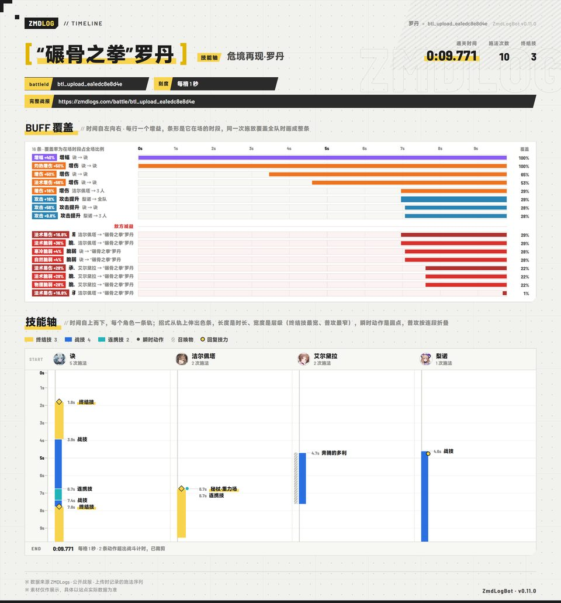

<div align="center">


# astrbot_plugin_zmdlog

### 终末地·藕粉铺子 — 在聊天里查 ZMDLogs 榜单、账号与战报

[](https://github.com/AstrBotDevs/AstrBot)
[](https://www.python.org/)
[](metadata.yaml)
[](LICENSE)
[](https://github.com/Statrue/astrbot_plugin_zmdlog/stargazers)

《明日方舟：终末地》DPS 速通榜 [ZMDLogs](https://zmdlogs.com) 的 AstrBot 插件：
一句话查榜单、账号、战报，回一张终末地风格的长图；
接了大模型就直接用自然语言问。

</div>

---

## ✨ 特性

- **榜单**：副本列表、副本或期数下各榜前三、具体榜单分页（每页 10 条，或一张图看前 30 条）、按角色 / 属性 / 职业筛选、阵容出场率与常见组合。
- **战报**：默认出摘要——用时、总 DPS、总伤害、阵容，加伤害构成、暴击期望、DPS 曲线；配装页、技能统计页、整页技能轴（带 BUFF 覆盖）；同一首领两场并排对比。
- **角色**：带某角色的队伍在各榜的最好名次，角色冠军榜（可按属性、职业、时间窗口），六星角色 DPS 分布（箱线图）。
- **账号**：公开账号各首领最佳记录、玩家排名、名次趋势（任何账号都有，不用关注）。
- **绑定**：在 ZMDLogs 网站生成绑定码，把自己和公开账号对上号；`我的` 看自己的成绩，`对比 <榜单> 我` 拿自己的最好记录对比第一名。
- **通报**：关注榜单（或全部榜单）后，榜单前三出现新纪录时在这里提醒，私聊也行；`新纪录` 看最近谁刷新了第一。
- **大模型工具**：4 个 function-calling 工具，一个主题一个；图是权威，文字给模型解读。
- **一张长图**：所有查询结果都是单张 PNG，统一的终末地视觉；具体榜单是 540px 宽、按 2 倍截取的手机长图，不用放大就能看清；战报摘要是 960px 宽、按 2 倍截取的宽图，点开放大看；其余页面正逐个换成新版式（换完之前仍是 1280px 宽）。渲染失败可退回 AstrBot 自带的文转图。
- **QQ 官方机器人**：候选列表、结果图、榜单通报下面带按钮，点一下选中、跳到网站或看同一对象的其他页面；可选一点即出图。见 [QQ 官方机器人](#-qq-官方机器人)。

## 📷 预览

| 具体榜单 | 战报 |
|:---:|:---:|
|  |  |
| **角色排名** | **角色冠军榜** |
|  |  |
| **技能轴** | **战报对比** |
|  |  |

## 📦 安装

AstrBot 面板 → 插件市场，搜「终末地·藕粉铺子」或 `zmdlog`，点安装。Python 依赖会自动装，Chromium 要自己补一次：

```bash
python -m playwright install chromium
```

也可以克隆到 AstrBot 的插件目录，在 AstrBot 使用的同一个 Python 环境里装依赖和 Chromium：

```bash
cd AstrBot/data/plugins
git clone https://github.com/Statrue/astrbot_plugin_zmdlog.git
cd astrbot_plugin_zmdlog
python -m pip install -r requirements.txt
python -m playwright install chromium
```

Docker 部署在宿主机执行：

```bash
docker exec -it astrbot python -m pip install -r /AstrBot/data/plugins/astrbot_plugin_zmdlog/requirements.txt
docker exec -it astrbot python -m playwright install chromium
docker restart astrbot
```

更新：市场装的在面板里点更新，克隆装的 `git pull --ff-only` 后重启 AstrBot；`requirements.txt` 有变化时先重新 `pip install`。

> 没装 Chromium 时插件会退回 AstrBot 自带的文转图服务（`fallback_to_astrbot_renderer`），能用，但样式和清晰度以内置 Chromium 为准。
> 渲染字体（Noto Sans SC / Barlow 子集，均为 SIL OFL 1.1）已内嵌；昵称里的生僻字会回退到系统字体，Docker 环境建议装一套中文字体（如 `fonts-noto-cjk`）。

## 🚀 快速开始

```text
/zmdlog                  帮助页
/zmdlog 罗丹              罗丹榜前 10 名（关键词认别名、拼音首字母：ld）
/zmdlog 战报 罗丹          罗丹第 1 名的战报摘要
/zmdlog 角色排名 洛茜       带洛茜的队伍在每个榜排第几
/zmdlog 角色档案 莱万汀     莱万汀大家怎么养、配什么、带谁
/zmdlog 关注 罗丹          罗丹前三出新纪录时在这里通报
```

## 🎮 指令

默认前缀是 `/`；AstrBot 改过唤醒前缀就用实际前缀。

### 榜单

| 指令 | 说明 |
|:---|:---|
| `/zmdlog 榜单` | 列出全部副本（按榜单列表的顺序），引用回复序号看该副本各榜前三；只有一张榜的副本（危机合约）直接出榜单 |
| `/zmdlog <关键词>` | 具体榜单第 1 页（第 1–10 名）；命中副本或期数时出其下各榜前三，只有一张榜的副本直接出榜单 |
| `/zmdlog <关键词> --页 <N>` | 第 N 页，每页 10 条（也写 `--page N`、`-p N`）；页码超出时回复一共几页 |
| `/zmdlog <关键词> --页 全部` | 一张长图看前 30 条（也写 `--页 all`）；超过 30 条时图底一行提示其余记录到 ZMDLogs 官网查看 |
| `/zmdlog <关键词> --角色 <角色名…>` | 只看带该角色的记录；写多个名字时只看同时带上他们的队伍 |
| `/zmdlog <关键词> --属性 <属性>` | 只看主 C 为该属性的记录 |
| `/zmdlog <关键词> --口径 rdps` | 该榜的 rDPS 排名（阵容、角色统计、角色排名、玩家排名、新纪录，以及按名次查的战报和对比也认这个选项） |
| `/zmdlog 阵容 <关键词>` | 职业位出场率、前 10 名的常见阵容与主 C 分布 |
| `/zmdlog 新纪录 [--范围 7d\|14d\|30d]` | 第一名易主、新上传的记录、各榜活跃度（默认近 7 天） |

榜单页每条记录是公开账号、四个头像（主 C 排第一个，套黄圈）、通关用时和 DPS；危机合约榜按合约分数排，分数放在用时的位置。翻页时 `--角色` / `--属性` / `--口径` 照样生效，图头的记录数是筛选后的条数；图上不提示下一页，翻页写 `--页 2`（QQ 官方机器人上也可以点按钮）。

阵容、账号页的头像下印 **养成**，和网站同一写法：`5+6` 是角色潜能 5、武器精炼 6，`5+?` 是武器未记录，潜能也没记录就不印。阵容页印每套阵容名次最好那一场的；榜单页和副本前三不印。

### 战报

| 指令 | 说明 |
|:---|:---|
| `/zmdlog 战报 <battleId 或链接>` | 战报摘要：用时（危机合约场先列合约分数）、总 DPS、总伤害、阵容，加伤害构成（每人一行，DPS 与伤害占比）、暴击期望、DPS 曲线（每条线标出最终 DPS 和峰值）。暴击期望固定本场技能与命中，只算暴击带来的伤害波动，画出期望总伤附近的分布和实际落在哪，写明高于或低于期望多少；只有 2026-09-25 起新客户端上传的战报有，缺数据的图整块不出。图底列出这场战报能看的页面，当前页高亮 |
| `/zmdlog 战报 <关键词> [名次] [--口径 rdps]` | 该榜第 N 名的战报摘要，默认第 1（`战报 罗丹 3`）；加 `--口径 rdps` 按 rDPS 榜的名次找（`战报 罗丹 1 --口径 rdps`），配装、技能、技能轴同样。直接给 battleId 或链接时不接受 `--口径` |
| `/zmdlog 配装 <同上>` | 每人的等级、潜能、武器、技能等级与四件装备词条（别名 `装备`） |
| `/zmdlog 技能 <同上>` | 每人各技能的次数、总伤、占比、均伤、最高（别名 `技能统计`） |
| `/zmdlog 技能轴 <同上>` | 整页施法节奏，上面是 BUFF 覆盖（别名 `排轴` / `时间轴`） |
| `/zmdlog 对比 <关键词> [名次A] [名次B] [--口径 rdps]` | 同一榜两场并排，默认第 1 对第 2（别名 `比较`）；`--口径 rdps` 按 rDPS 榜的名次取，页上名次写作「rDPS 第 N 名」 |
| `/zmdlog 对比 <关键词> 我 [名次] [--口径 rdps]` | 自己主账号在该榜（按所给口径）的最好记录对比第 N 名，默认第 1 名，名次靠前的一场在左。要先 `绑定`；没绑定、主账号在这张榜上没有记录（不会换用别的绑定账号）、自己就是第 N 名时各回一句话。关键词命中多张榜时，回复序号或点按钮的人就是「我」。群聊私聊都能用 |
| `/zmdlog 对比 <battleId> <battleId>` | 指定两场并排；须是同一首领 |

### 角色与账号

| 指令 | 说明 |
|:---|:---|
| `/zmdlog 角色排名 <角色名…>` | 带该角色的队伍在每个榜的最好记录（任何星级）；写几个名字就只看同时带上他们的队伍 |
| `/zmdlog 角色排名 [--属性 X] [--职业 X] [--范围 X]` | 角色冠军榜：每个角色的队伍拿下的第一、前三、前十各几个 |
| `/zmdlog 角色统计 [关键词] [--范围 X] [--潜能 X]` | 六星角色 DPS 分布：不填看全部榜单，填榜单看该榜，填角色名看它在各榜 |
| `/zmdlog 角色档案 <角色名> [--榜单 X] [--范围 7d\|14d\|30d\|all]` | 网站的角色页：养成组合、武器、装备、常见队友各占多少，加它在各榜的通关名次（该榜全部角色按所在队伍的最快通关排名，同队同名次）、最快用时和那场的账号。样本是带该角色的公开有效通关，同一账号在同一榜只算最快一场；任何星级都有。`--榜单` 接榜单关键词（同 `/zmdlog <关键词>`），只看那一个榜：四块占比只算该榜，通关名次表换成该榜带这个角色的记录（最多 20 条，按用时排，带账号、日期和养成）；关键词命中副本或期数时列出其下各榜供选，危机合约没有角色档案。`--口径`、`--潜能` 上游不认，不接受 |
| `/zmdlog 玩家排名 [--范围 X]` | 各公开账号的第一、前三、前十各几个（写昵称则是那个人的成绩）|
| `/zmdlog 账号 <昵称、accountId 或主页链接>` | 公开账号各首领最佳记录。从榜单索引读，刚上传又没进前三的纪录要等索引重读到那个榜才出现；索引里查不到的账号才问 ZMDLogs，这时网站榜单列表里没有的榜也会列出，标「未收录榜单」 |
| `/zmdlog 趋势 <账号> [--范围 7d\|14d\|30d\|all]` | 任一公开账号各榜名次随时间的变化（默认近 30 天，`all` 是保留的近 90 天）；从机器人第一次读到它在榜上起记录，之前没上过榜的账号回复暂无记录 |

### 绑定

| 指令 | 说明 |
|:---|:---|
| `/zmdlog 绑定 <绑定码>` | 把自己和一个 ZMDLogs 账号对上号。绑定码在网站登录后从 账号菜单 → 机器人绑定（`/account/binding`）生成，10 分钟内有效，只能用一次；只认绑定码，不认昵称或 accountId。这一组指令（连同 `对比 … 我`）群聊私聊都能用；绑定认的是人，在哪绑的都一样 |
| `/zmdlog 我的 [序号或昵称]` | 自己绑定账号的各首领最佳记录（同 `账号 <accountId>`），默认主账号 |
| `/zmdlog 主账号 [序号或昵称]` | 列出自己的绑定；带参数则把那个号设为主账号（一人最多绑 5 个） |
| `/zmdlog 解绑 [序号、昵称或 全部]` | 解除绑定；只绑了一个号时不用带参数 |

### 关注与管理

| 指令 | 说明 |
|:---|:---|
| `/zmdlog 关注 <榜单关键词>` | 把一张榜加入这里的关注，前三名出新纪录时通报；关键词命中副本时回候选列表。群聊私聊都能用，群里按整个群算 |
| `/zmdlog 关注 全部` | 关注全部榜单，以后新出的榜单也自动包含；单张榜用 `取关 <榜单关键词>` 排除，`关注 <榜单关键词>` 恢复 |
| `/zmdlog 关注` | 这里的关注列表与序号；关注全部榜单时显示「全部榜单」和排除了哪几张 |
| `/zmdlog 取关 <序号或榜单关键词>` | 取消关注一张榜；关注全部榜单时记为排除（添加者本人或管理员） |
| `/zmdlog 取关 全部` | 清空这里的关注（每条都得是自己加的，或管理员） |
| `/zmdlog 别名` / `别名 添加 <榜单或副本> <别名…>` / `别名 删除 <别名>` | 管理员维护群里的叫法，立即生效 |

1.3.0 起只能关注榜单：关注账号连同它的轮询一起去掉了，升级时已有的账号关注条目直接丢弃，榜单关注原样保留。`关注 榜单 罗丹` 这种旧写法不再特殊，「榜单 罗丹」按普通关键词匹配；`关注 <昵称>` 匹配不到榜单就回「没有找到」。想看某个账号的名次走势用 `趋势`，任何账号都有，不用关注。

### 关键词与选项

- 榜单名可以省略难度和副本前缀（`罗丹`、`山犼争王`），副本可以写一段或"系列+期数"（`山中见犼`、`丰碑4`、`影拓4`），拼音全拼和首字母都认（`luodan`、`ld`、`fb4`）。管理员加过的别名优先于自动推导的。
- 匹配到多个目标时回一份编号候选列表，**引用那条消息回复序号**（`2`、`②`、`第2个` 都行）即可，10 分钟内有效。QQ 官方机器人上每个候选下面另有按钮，见下一节。
- 直接输入昵称时，榜单没有精确命中就同时搜索公开账号。
- 选项写在末尾，`--选项 值`，顺序不限。`--页` 认页码（`1`、`2`…）和 `全部` / `all`，也写 `--page`、`-p`；原来的 `--top` 已取消，写了会提示改用 `--页`。`--属性` 认 物理 / 灼热 / 寒冷 / 自然 / 电磁，也认 火、冰、雷；`--职业` 认 先锋 / 近卫 / 重装 / 术士 / 突击 / 辅助，术师也认；`--范围` 认 `7d/14d/30d/all`，也认 一周、两周、一个月、近 30 天；`--潜能` 只有 `0`（零潜）/ `1-5`（有潜能）/ `all` 三档，这是上游接口的粒度。
- `--口径 rdps`（也认 `团队贡献`）看每个榜的 rDPS 排名：只收录能算出团队贡献的记录（新版上传器的上传，目前很少），名次仍按通关时间排，主 C 按 rDPS 最高的角色算；具体榜单页图头的记录数就是 rDPS 榜的条数。不写口径就是 DPS，关注、趋势、账号页只有 DPS。
- `--角色` 优先看以该角色为主 C 的记录，该榜没有时自动改为看整个阵容。

## 🔘 QQ 官方机器人

插件按每条消息看它来自哪个平台。AstrBot 内置的 QQ 官方机器人适配器（`qq_official`，WebSocket 版）上多出按钮，其他平台一切照旧。按平台分三层：

**1. 野生机器人（OneBot / NapCat 等）和其他所有平台**：就是上面写的样子，没有按钮，候选列表引用回复序号。

**2. QQ 官方机器人（默认）**：群聊和私聊一样。

- **候选列表**：每个候选下面一个按钮，点一下把那一项的完整指令填进输入框（账号用 accountId、榜单用 slug，原来的名次和 `--选项` 照带；`榜单` 的副本列表就是副本名本身；`角色档案 --榜单` 的榜单列表是 `角色档案 <角色名> --榜单 <slug>`），发出去即出图。副本列表超过 5 项时按钮并排，影拓丰碑的副本只写后半段（「4 灼痛疤痕」），超过 25 项的只能引用回复序号。按钮里存的是指令本身，不受 10 分钟的限制，机器人重启后也能用，谁都可以点。引用回复序号的老用法照旧。
- **结果图**：关于一个账号、一场战报、一个榜单（含单个榜单的角色统计）或一个角色（角色档案）的图下面带一个「在 ZMDLogs 打开」按钮，直达网站上的对应页面（带 `--榜单` 的角色档案打开网站角色页上的同一个榜）；再有至多 3 个按钮看同一对象的其他页面（配装、技能、技能轴互通，并各有一个回到战报摘要的「摘要」按钮；阵容、角色统计与榜单互通（榜单页的按钮见下）；账号与名次趋势互通；角色档案下有同一角色的角色统计和角色排名，角色统计只有六星有），点一下把指令填进输入框，沿用原来的口径；这场战报或这个账号没有的页面不出按钮。帮助、对比、跨榜单的统计与排名这类不针对单一对象的页面不带按钮。
- **榜单页**：三行按钮。第 1 行「阵容」「角色统计」「第一名战报」「对比第一名」；第 2 行「全部」「下一页」；第 3 行「在 ZMDLogs 打开」。「第一名战报」和「对比第一名」指整张榜的第 1 名（不是筛选后的第一行），rDPS 榜上带 `--口径 rdps`；「对比第一名」填的是 `对比 <榜单 slug> 我`，谁发出去（开了回调就是谁点）谁就是「我」，没绑定、在这张榜上没有记录、自己就是第 1 名时各回一句话。「全部」「下一页」照带当前的 `--角色` / `--属性` / `--口径`；最后一页没有「下一页」，`--页 全部` 的图和只有一页的榜两个都没有。`全部` 图超过 30 条时，第 2 行换成「官网查看其余 N 条」，打开网站上的这张榜——和「在 ZMDLogs 打开」是同一个链接，所以这时不再有第 3 行。
- **副本前三页**：图下面是该副本（或一个范围，如「影拓丰碑1期」）每张榜一个按钮，按榜单目录的顺序，点一下把 `zmdlog <榜单 slug>` 填进输入框，发出去就是那张榜的榜单页；查副本时带了 `--口径 rdps`，按钮也带。超过 5 张榜时按钮并排，各榜名字里共有的部分不写（战争回响的「·残酷」、危境再现的「危境再现·」），超过 25 张的只能打榜名。网站上没有副本页，所以没有「在 ZMDLogs 打开」；榜单页的按钮不变，不挂同副本的其他榜。
- **绑定**：叫你去生成绑定码的提示下面带一个「去 ZMDLogs 生成绑定码」按钮。
- **榜单通报**：由插件自己发，不经过 AstrBot（AstrBot 到 4.28.2 为止，重启后没人说过话的群收不到主动消息，却报告已发送，通报会就此丢失）。通报提到的每场战报在正文里标成「战报 1」「战报 2」……，下面各有一个同名按钮，点开就是网站上那场战报。发送失败就记为失败，下一轮重发。
- **其他文字回复**（错误提示、关注 / 取关 / 别名 / 绑定的回复）按纯文本发，昵称里的 `*`、`_` 不会把回复排成粗体或斜体；候选列表和带按钮的通报是 markdown，昵称会转义。
- **帮助页**多两行小字：没开「获取群内全部消息」的群，指令前要先 @机器人；榜单通报要群主或管理员先开「机器人主动在群聊内发言」。

哪一步发不出去，就改发其他平台上的样子：候选列表退回纯文本，结果图退回普通图片，通报退回纯文本（链接照旧印在正文里）。配置 `disable_qq_official_buttons` 一开，官方机器人上的回复全部回到这个样子。

**3. 开了回调的 QQ 官方机器人**（配置 `qq_official_callbacks`，默认关闭）：候选按钮、结果图下查看其他页面的按钮、榜单页的翻页与对比按钮和副本前三页的榜单按钮改为点一下直接出图，不经过输入框（「对比第一名」以点按钮的人为「我」）；关注这类改设置的按钮仍然只填指令——点击直接执行的只有查询，改不了设置。AstrBot 本身收不到按钮点击，插件每次加载时在运行时给内置 `qq_official` 适配器打一个最小补丁（订阅按钮回调事件），不改 AstrBot 本体，WebUI 里升级 AstrBot 后照常生效；不需要公网地址。改了开关要重启官方机器人平台（或 AstrBot）才生效。补丁装不上（适配器结构和预期不符、AstrBot 已自带回调）时，自动退回第 2 层。

不支持的组合：

- **与 qqoffice_expand 不兼容。** 两个插件会抢着应答同一次点击，按钮时灵时不灵。插件检测到 expand 启用就不装回调，记一条警告，按钮照旧填指令；想要一点即出图，请停用 expand。
- **`qq_official_webhook`（Webhook 版）没有按钮，也没有回调**，按其他平台对待，榜单通报照旧交给 AstrBot。
- **`qq_official_v2`（v2adapter）没有按钮**；只是它上面的绑定和关注按 `qq_official` 记，换适配器不用重新绑定。
- **大模型工具发的图**在任何平台上都是普通图片，不带按钮。

## 🤖 大模型工具

AstrBot 接入大模型并开启函数调用后，群友直接用自然语言问：

| 工具 | 回答什么 |
|:---|:---|
| `zmdlogs_board_ranking` | 某榜前几名（用时、DPS、主 C、阵容与每人养成、日期、落后第一几秒）、职业位出场率、常见阵容；可按角色 / 属性 / 职业 / 时间窗口筛；填副本看其下每个榜的前三，填"全部"列出所有榜的第一名（只回文字，不附图），留空看最近的新纪录 |
| `zmdlogs_battle_report` | 某场战报：用时、各角色 DPS、暴击率、最大单次、暴击期望（新客户端上传的战报）、配装与套装、伤害来源、BUFF 覆盖、施放次数、开场顺序、危机合约分数与词条分布；给第二场就并排对比 |
| `zmdlogs_character_standings` | 某角色的队伍在各榜的最好名次、最常同队的人、六星 DPS 分布（可限定范围和潜能）；只问一个角色时，文字开头总带两行摘要（公开记录里最常见的养成组合和武器及占比，只在文字里）；`view` 填 `档案` 改附角色档案图，文字给养成、武器、装备、队友的占比和各榜通关名次（可限定榜单和范围）；留空看角色冠军榜（可按属性、职业筛） |
| `zmdlogs_account_records` | 某公开账号各首领最好成绩（含阵容与每人养成，和账号页一样从榜单索引读）、记录数、冠军数、常用主 C 和阵容、有记录时的名次变化；留空看玩家排名 |

几条刻意的设计：

- **一个主题一个工具，不按功能点拆。** 每条经过模型的消息都带上全部工具的说明，工具越多越贵，相近的工具越多模型越容易选错。
- **图是权威，文字是解读。** 工具把长图发到群里，同时把事实以文字交给模型，并要求模型不要复述数字；一次回答只查了一个对象才发图。唯一只在文字里的数字是角色工具的两行摘要：它们来自那次回答没有画出的角色档案。
- **只回答"公开记录里有什么"，不回答"谁更强"。** 榜单是自我选择的样本，出场次数、名次、分布都可以答，强度判断和循环 DPS 不在范围内。
- **拿不准就说拿不准。** 关键词只是勉强相似时工具直接说没有可靠匹配，而不是猜一个最接近的。

## ⚙️ 配置

在 AstrBot 的插件配置页修改，通常无需改动。

| 配置项 | 默认 | 说明 |
|:---|:---|:---|
| `api_base_url` | `https://zmdlogs.com` | ZMDLogs API 地址 |
| `web_base_url` | `https://zmdlogs.com` | 网页地址，用于识别链接、拼接头像和主页 |
| `request_timeout_ms` | `10000` | API 请求超时 |
| `render_timeout_ms` | `30000` | 图片渲染超时 |
| `fallback_to_astrbot_renderer` | `true` | 内置 Chromium 不可用时改用 AstrBot 的文转图 |
| `alias_file_path` | `aliases.json` | 别名文件，相对 `data/plugin_data/astrbot_plugin_zmdlog/` |
| `auto_expand_battle_links` | `false` | 群里出现战报链接时自动回战报摘要 |
| `battle_link_dedupe_seconds` | `300` | 同群同战报自动展开的冷却 |
| `fuzzy_match_threshold` | `0.65` | 模糊匹配最低可信阈值 |
| `ambiguity_score_gap` | `0.08` | 要求用户选择候选的最小分差 |
| `rank_watch_enabled` | `true` | 榜单通报（关注 / 取关 与轮询）；关闭后已有关注仍可查看和取消 |
| `rank_watch_interval_seconds` | `900` | 榜单通报的检查间隔，每轮一个请求，最低 120 |
| `rank_watch_rank_threshold` | `10` | 通报的前 N 名（关注账号去掉后暂不起作用，按榜单变动通报时启用） |
| `bindings_enabled` | `true` | 账号绑定（绑定 / 我的 / 对比 … 我）；关闭后已有绑定仍可查看和解除 |
| `disable_qq_official_buttons` | `false` | 关掉 QQ 官方机器人（`qq_official`）的按钮与纯文本回复：候选列表、结果图、绑定提示和榜单通报都不带按钮，文字回复回到适配器默认的 markdown |
| `qq_official_callbacks` | `false` | QQ 官方机器人的按钮点一下直接出图（回调按钮）。插件在运行时给内置 `qq_official` 适配器打一个最小补丁（订阅按钮回调事件），不改 AstrBot 本体，每次加载重新打；改动后重启官方机器人平台（或 AstrBot）生效。与 qqoffice_expand 不兼容，检测到它启用就不装回调、按钮照旧填指令；官方机器人若因此连不上（4013/4014），关掉此项。`disable_qq_official_buttons` 打开时不起作用 |

## 🔍 它是怎么工作的

- **榜单索引**：启动后把全部榜的排名读进内存（约 5 MB，十几秒）。所有查询都从索引读，不等上游，只有索引还没读到的榜才现读一次。查单个榜（榜单页、榜单工具）时，这个榜超过 2 分钟没核对过就在后台立刻补读，再查一次就是新的。每份排名多久重读一次，看它多久没变：间隔是「距上次变化」的十分之一，最短 5 分钟、最长 6 小时，所以活跃的榜几分钟读一次，没人打的榜几小时读一次；重载后每个榜从它最新那条纪录的时间算起。各榜前三每分钟核对一次（连续 2 小时都没变就改成 5 分钟一次，一变马上恢复），前三变了立即重读。后台重读平均每分钟最多 3 次（最多连发 4 次），有人刷屏也只改变先读哪个榜。读失败的榜照旧用手里的副本，5 分钟后再试；连续失败时整体按指数退避，最长 10 分钟一次。代价是冷门榜上前三以外的新纪录可能晚几个小时才出现。
- **通报只说能证明的事**：榜单通报比较的是这张榜前后两次读到的前三名，所以能说出哪条是新纪录、谁跌出了前三。每轮读一次榜单列表（一个请求）就覆盖所有被关注的榜；关注全部榜单的聊天跟着这份列表走，新开的榜第一次读到时只记下基准，下一条新纪录起通报。
- **绑定只认绑定码**：机器人拿着绑定码向 ZMDLogs 查一次它对应哪个账号，查到就绑；网站只把码发给登录了那个账号的人，所以不会有人冒绑。查码接口不消耗码，插件自己记住用过的码的摘要，同一个码第二个人再发就拒绝。插件不缓存绑定码，也不把它写进日志（请求日志里显示为 `ZMD-****-****`）。绑定、解绑、主账号、我的和 `对比 … 我` 在群聊和私聊都响应。QQ 官方机器人上同一个人私聊和群里的 ID 是否相同还没实测过，若不同，私聊里绑的账号在群里认不出来，在群里再绑一次即可。绑定和关注按「平台:发送者 ID」认人：QQ 官方机器人从 `qq_official` 换到 `qq_official_v2` 适配器，发送者 ID 不变，按同一个人记，绑定照旧有效；`qq_official_webhook` 和野生机器人（如 `aiocqhttp`）各记各的。
- **名次趋势**：榜单索引每读一次 DPS 榜（启动后第一次读和之后每次重读），就把榜上每个账号的名次（取它在这个榜最好的那条纪录）和它趋势里这个榜的最后一个点比较，变了才记一个点；账号从榜上消失不记点，rDPS 榜不记。比较的是存下的最后一个点，所以重启后第一次读取能接上，不会多记一个假变化。点保留 90 天，每个账号每个榜至少留最新的一个点（那就是它现在的名次），每榜最多 500 个点。所有账号 90 天约 5 MB；文件不缩进，有变化时最多 5 分钟写一次，停机前再写一次。1.3.0 以前只记关注过的账号，那些记录原样保留、接着记。
- **本地文件**（都在插件数据目录，只含公开 accountId、公开昵称、名次和 battleId；1.3.0 以前的 `rank-snapshot.json` 不再使用，可以删掉）：`watchlist.json`（各聊天关注的榜单；1.3.0 以前文件里的账号关注读取时丢弃）、`board-snapshot.json`、`rank-history.json`（全部账号的名次趋势，见上一条）、`record-events.json`（30 天 / 1000 条）、`hot-bosses.json`（上游不可达时的榜单列表快照）、`aliases.json`、`bindings.json`（平台用户 ID ↔ 公开 accountId 与昵称快照、用过的绑定码的 SHA-256；1.3.0 以前的文件里还有一份「用过绑定指令的群」，读取时忽略，下次写入时去掉）。读不出来的文件会改名为 `.corrupt-<时间>` 并写日志，不会被静默覆盖。
- **渲染**：最多 2 张图同时渲染、8 个排队；头像等图标只允许从配置的域名加载并在内存缓存 30 天；输出图片定期清理。

## ❓ 常见问题

**提示"图片生成失败"** — 确认 Chromium 装在 AstrBot 实际使用的 Python 环境里（`python -m playwright install chromium`），Docker 用户还要确认 `/AstrBot/data` 可写并完整重启容器。

**提示"ZMDLogs 暂时不可用"** — 检查 AstrBot 所在机器到 `https://zmdlogs.com` 的连通性，看日志里的 `ZmdLogBot … request failed`。

**提示"榜单索引还在建立"** — 刚启动的十几秒内会这样，稍后再问即可。

**昵称查不到账号** — 昵称需要 2–64 个字符，只能搜到有公开记录的账号；多个结果时回复序号，或直接用 accountId / 主页链接。

**`--top` 报错** — 1.3.0 起改为分页：`--页 2` 看第 11–20 名，`--页 全部` 一张图看前 30 条。`--页` 只作用于具体榜单，副本页固定前三，阵容固定按前 10 名统计。

**提示"当前配置的 ZMDLogs 地址没有绑定码接口"** — `api_base_url` 指向的镜像或旧部署没有绑定码功能；官方站 zmdlogs.com 已经有了。

**开着 AstrBot 的「隔离对话」** — 不影响本插件：关注列表、候选列表都按整个群算。1.0.2 及以前在隔离对话下是按人记的，升级后第一次启动会自动并回所在的群，日志里会有一行 `ZmdLogBot … moved …`。

## 🛠️ 开发

```bash
python -m unittest discover -s tests -v      # 全部测试，离线，约 4 秒
python -m ruff check main.py qq_official.py core tests tools
```

只有 `main.py` 和平台适配模块 `qq_official.py` 接触 AstrBot，后者装着插件在 QQ 官方机器人上替 AstrBot 做的事（自己调 botpy 发送、榜单通报、回调补丁），AstrBot 支持以后整块删掉；`core/` 里是全部逻辑，不引用 AstrBot，可以单独测。每个模块的设计与取舍写在它自己的 docstring 里；不变量与设计决策见 [CLAUDE.md](CLAUDE.md)，上游接口事实见 [UPSTREAM.md](UPSTREAM.md)，视觉资源说明见 [resources/common/ASSETS.md](resources/common/ASSETS.md)。

## 📄 数据、许可与鸣谢

- **非官方项目。** 本插件是 [ZMDLogs](https://zmdlogs.com) 的第三方客户端，与 ZMDLogs 站方无从属关系，也与《明日方舟：终末地》的开发商上海鹰角网络无关。游戏名称、角色、头像等素材的版权归鹰角所有，本插件只在渲染时按公开地址引用，不在仓库内分发；唯一的例外是帮助页上的几个《加油吧！终末地》官方 Q 版小人，它们缩小后以 WebP 内嵌在帮助页里（`resources/help/`）。
- 只读取 ZMDLogs 已公开的榜单、账号成绩和战报，不处理登录凭据或私人记录；内容以上游为准。绑定只保存平台用户 ID 和公开 accountId 的对应关系，ZMDLogs 不会收到 QQ 号。预览截图里的昵称与成绩都是当时榜单上的公开信息。
- 请求量：后台重读平均每分钟最多 3 次，按服务器的新纪录日志估算每天约 1300 次（平均每分钟不到 1 次），另外每 1–5 分钟核对一次各榜前三（见[它是怎么工作的](#-它是怎么工作的)）；User-Agent 标明了插件名与版本。若 ZMDLogs 站方希望调整频率或停用某项功能，请开 issue，我会照办。
- [MIT License](LICENSE)，仅覆盖本仓库的代码与自绘素材。内嵌字体各有其许可，见 [ASSETS.md](resources/common/ASSETS.md)。
- 感谢 [ZMDLogs](https://zmdlogs.com) 提供公开数据，[AstrBot](https://github.com/AstrBotDevs/AstrBot) 提供运行框架。

<div align="center">

如果这个插件对你有帮助，欢迎点一个 Star。

</div>
